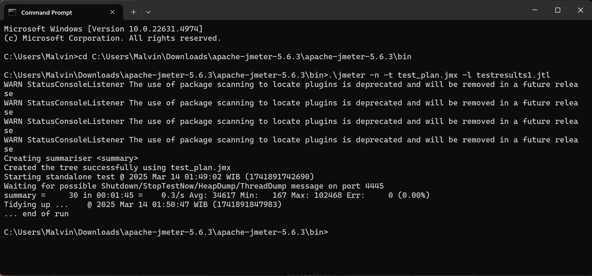

# Module 5

## Before Optimization
all-student request, all-student-name, and highest-gpa request.

### View Result Tree 

### View Result Table

### Graph Results

### Summary Report

### Command Line

### Log File Results

## After Optimization
all-student request, all-student-name, and highest-gpa request.

### View Result Table

### Command Line

### Log File Results

## Conclusion
- **all-student**

    **Before optimization**, the sample time to process the request was approximately 98,000ms.
    **After optimization**, the sample time decreased to approximately 6,700ms. This resulted in a speedup of over 1300%.

- **all-student-name**

    **Before optimization**, the sample time to process the request was approximately 2,800ms. 
    **After optimization**, the sample time decreased to approximately 300ms. This resulted in a speedup of over 833%.

- **highest-gpa**

    **Before optimization**, the sample time to process the request was approximately 558ms.
    **After optimization**, the sample time decreased to approximately 60ms. This resulted in a speedup of over 830%.

## Reflection

### Differences Between Performance Testing with JMeter and Profiling with IntelliJ Profiler

JMeter is primarily used for performance testing by simulating many users and measuring system response under load. This tool helps identify performance issues such as latency, throughput, and resource utilization under stress conditions. On the other hand, IntelliJ Profiler is used to analyze the internal processes of an application, such as CPU usage, memory allocation, and method execution time. JMeter provides a broad overview of system performance, while IntelliJ Profiler offers deeper insights into bottlenecks at the code level.

### The Role of Profiling in Identifying Application Weaknesses

Profiling plays an essential role in identifying and understanding the weak points of an application. By analyzing CPU usage and memory consumption, I can find inefficient algorithms, excessive operations, or memory leaks that can slow down performance. This tool allows me to track function calls and their execution time, helping uncover code areas that need optimization.

### Effectiveness of IntelliJ Profiler in Identifying Bottlenecks

IntelliJ Profiler has proven effective in helping me analyze and identify bottlenecks in the application's code. The tool provides detailed visualizations of CPU and memory usage, making it easier to detect inefficient code paths and operations that hinder performance. The ability to analyze method execution times and object allocation is very helpful in refining critical parts of the application.

### Challenges in Performance Testing and Profiling

The data obtained from performance testing and profiling can be quite complex, requiring careful analysis to draw meaningful conclusions. To tackle this challenge, I make sure to observe the data closely to ensure that I draw accurate conclusions.

### Benefits of Using IntelliJ Profiler

- **In-Depth Analysis:** Provides detailed insights into code execution, helping to identify inefficiencies.

- **Real-Time Monitoring:** Allows me to observe performance changes dynamically during execution.

- **Integration with IntelliJ IDEA:** Integration with the IDE accelerates the debugging and optimization process.

### Handling Inconsistencies Between Profiling and Performance Testing

Sometimes, the results from IntelliJ Profiler do not fully align with findings from performance testing using JMeter. In such situations, I cross-check system-level performance metrics with code-level insights to identify the source of inconsistencies. Factors such as network latency, database performance, or background processes can contribute to unexpected result variations.

### Application Code Optimization Strategies

- **Code Refactoring:** Improving inefficient algorithms and reducing excessive operations.

- **Memory Optimization:** Identifying and fixing memory leaks to reduce excessive resource consumption.

- **Database Query Optimization:** Enhancing database interactions to minimize slow queries.

To ensure that the changes I make do not negatively affect the functionality of the application, I follow these best practices:

- Conducting thorough testing after changes.

- Running performance tests before and after optimization to measure improvements.

- Monitoring real-world performance metrics after implementation to validate improvements.
